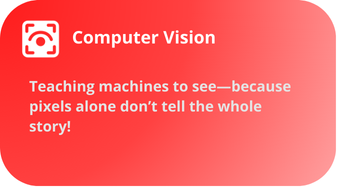
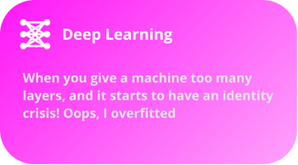

 

💫 About Me

---
 

 🚀 Me? I don’t know!… Just an AI Engineer building smart machines—ironically still trying to understand humans. 🤖🤯 

 🌟 What I Do : 

  
  
  

  

    
  

  

    
  

  

    
  

  

    
  

---

🧰 Languages and Tools

---
 

  
  
  
  
  
  
  

  
  
  
  
  
  
  
  

  
  
  
  
  

---

📚 My Scientific Research Articles

---

  <ul style="list-style-type: none; padding: 0;">
    <li style="font-size: 18px; margin-bottom: 10px;">
      <a href="https://link-to-article-1.com" target="_blank" style="text-decoration: none; color: #0073e6;">
        <strong>Title of Article 1</strong> – A brief description of the article or the field it addresses.
      </a>
    </li>
    <li style="font-size: 18px; margin-bottom: 10px;">
      <a href="https://link-to-article-2.com" target="_blank" style="text-decoration: none; color: #0073e6;">
        <strong>Title of Article 2</strong> – Another brief description of the article or its significance.
      </a>
    </li>
    <li style="font-size: 18px; margin-bottom: 10px;">
      <a href="https://link-to-article-3.com" target="_blank" style="text-decoration: none; color: #0073e6;">
        <strong>Title of Article 3</strong> – Description or abstract of this research paper.
      </a>
    </li>
  </ul>

